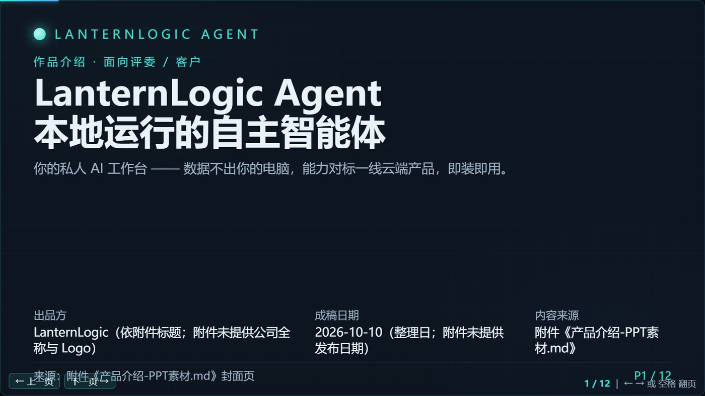
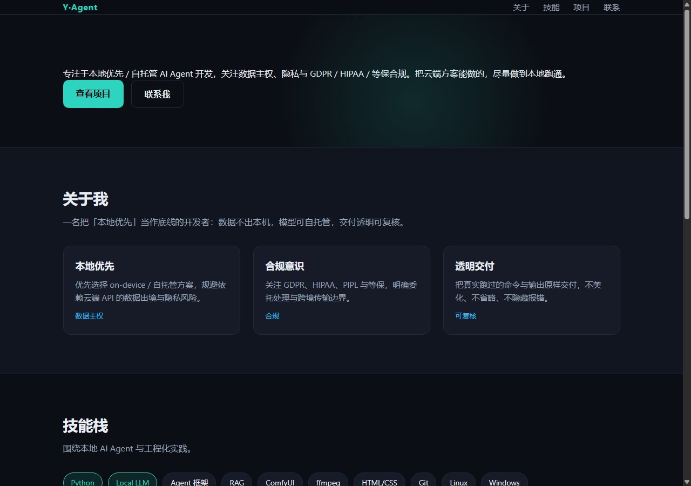
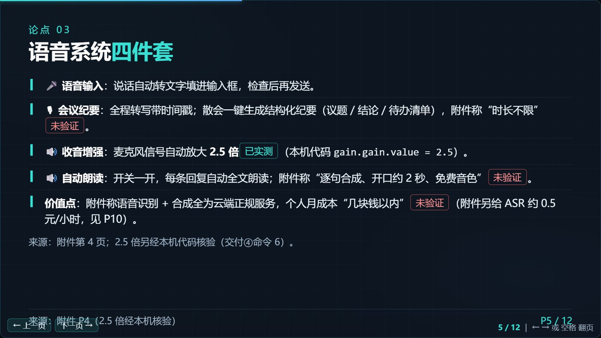
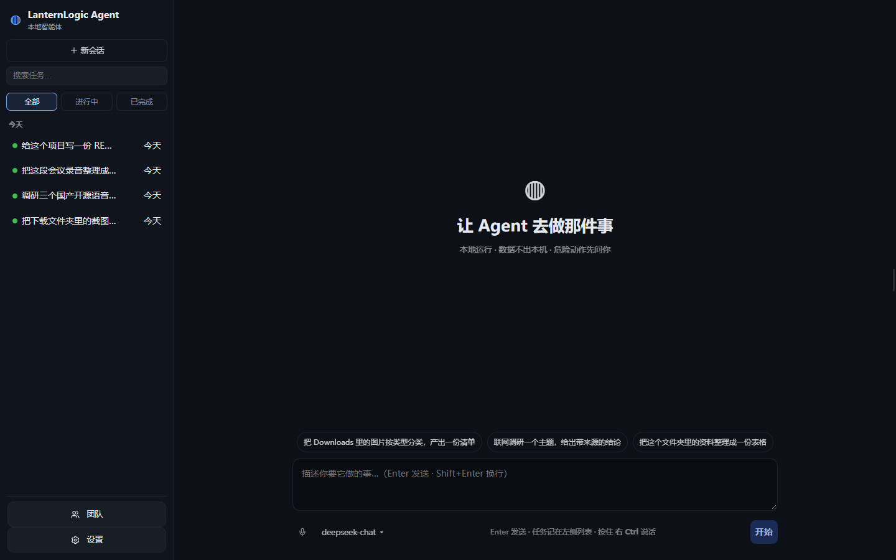
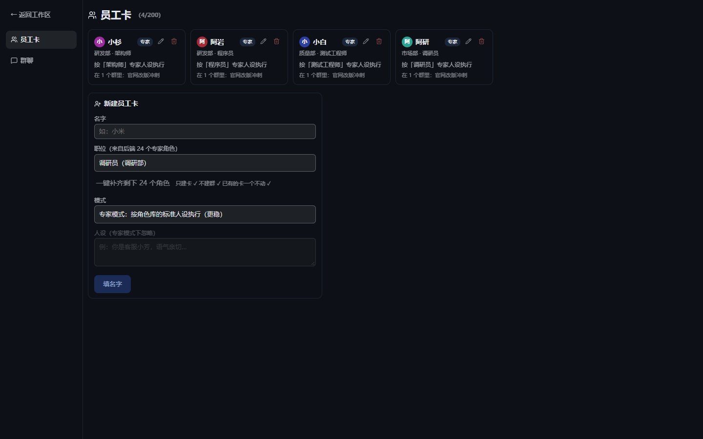
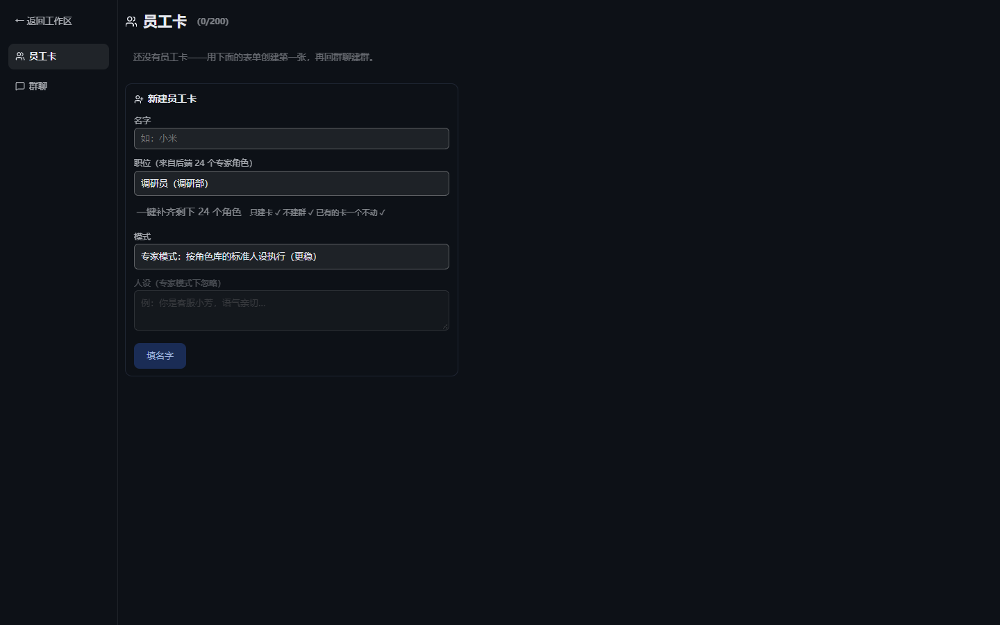

# LanternLogic Agent

> **本地优先的通用 Agent**——一句话任务，自己规划、调用 **22** 个工具、交付产物。
> **默认全本地**；只有你主动用云端模型 / 搜索 / 云端出图出视频时，它才联网。

> ### 🌏 下载地址（两个镜像，内容完全一致）
> - **GitHub（主站）**：<https://github.com/yqrsyg2gz5-blip/lanternlogic-agent>
> - **Gitee（国内镜像，访问更快）**：<https://gitee.com/yangbo0801/lanternlogic-agent>
>
> 两边是同一份代码、同一个提交 ✓ 从哪边下载都一样 ✓ 连不上 GitHub 就用 Gitee ✓
>
> ★ 想直接跑起来（不用配 Python/Node）⇒ 去 **[Releases](https://github.com/yqrsyg2gz5-blip/lanternlogic-agent/releases)** 下载 zip ✓（已含构建好的前端 ✓）

> ### 🔑 三句话先说清
> - **免费用 ✓ 商用也免费 ✓** —— 个人、企业、组织都能用，**包括拿它做收费服务** ✓
>   （成本只有你自己的模型 Key 费用；AGPL 允许商用 ✓ **不用向我们申请** ✓ 我们也不收「商用许可费」✓）
> - **产出归你 ✓** —— 它给你做出来的东西（代码、文档、网页…）都是你的 ✓
> - **只有一件事必须守 ✓** —— 你**改了它、又通过网络对外提供服务**（网站 / SaaS）⇒
>   **你改的那部分也得开源** ✓（AGPL 第 13 条 ✓）
>   - **不想承担这个开源义务**（闭源集成 / SaaS 不开源 / OEM）⇒ **买商业授权** ✓
>     见 [COMMERCIAL.md](./COMMERCIAL.md) —— 买的是「**免除开源义务**」✓ 不是「商用许可」✓
>
> 完整条款见 [LICENSE](./LICENSE) 与 [TERMS.md](./TERMS.md)；隐私见 [PRIVACY.md](./PRIVACY.md)。

### 📸 它做出来的东西（**真跑出来的产物** ✓ 不是效果图 ✗）

| 让它做 PPT | 让它做网页 |
|---|---|
|  |  |
| 12 页 HTML 幻灯片 ✓ **自己开浏览器截图验收** ✓ | 单页个人主页 ✓（这张是**本机 27B 小模型**跑出来的 ✓） |
|  |  |
| 每页标来源 ✓ 能力分「**已实测 / 未验证**」✓ —— 没把握的**不写成卖点** ✗ | 出图 ✓（本地 ComfyUI **约 9 秒**一张 ✓ 或云端通义万相 **约 13 秒** ✓） |

> **交付前它会自己验一遍** ✓：写代码必 `code_check` + 真跑 ✓；
> 网页/可交互产物**真开一次浏览器、把页面上每个按钮逐个点一遍** ✓ ——
> 点了没反应就判为**缺陷**并写进交付说明 ✗（"跑通了自测" ≠ "验收通过" ✓）


**自己研发的通用 Agent 运行时**：事件流驱动、接口先行，每一层（模型 / 执行环境 / 存储 / 工具 / 审批）都可替换。
（第三方开源组件与可选模型各自适用其自身许可，见 [THIRD-PARTY.md](./THIRD-PARTY.md)。）

> 当前授权：**GNU Affero 通用公共许可证 v3.0（AGPL-3.0-only）** —— 真·开源 ✓
> 你可以自由使用、修改、分发（**包括商用**）✓ 条件是：**改了并对外提供网络服务，就得开源你改的那部分** ✓
> 不想承担这个开源义务（闭源集成 / SaaS 不开源 / OEM）⇒ **买商业授权** ✓ 见 [COMMERCIAL.md](./COMMERCIAL.md)
> ★ 源码仓库（AGPL 第 13 条要求：用网络访问本程序的人能拿到源码 ✓）：
> - GitHub：<https://github.com/yqrsyg2gz5-blip/lanternlogic-agent>
> - Gitee（国内镜像）：<https://gitee.com/yangbo0801/lanternlogic-agent>

## ✨ 能力总览

| 类别 | 能力 |
|------|------|
| 大脑 | 10 个提供者即插即用：DeepSeek / Qwen / GLM / Kimi / MiMo / Claude / Ollama（本地）/ 任意 OpenAI 兼容端点 |
| 动手 | 文件读写、shell 命令（Git Bash/cmd 可配）、沙箱工作区 + 授权目录 |
| 联网 | 搜索（Bing 解析，可换 SearXNG）、网页抓取、**真实浏览器窗口操作**（Playwright 驱动系统 Edge） |
| 多媒体 | **作图**（本地 ComfyUI SDXL，或云端通义万相等）、**看图**（视觉模型）、**说话**（MeloTTS 本地离线 / Edge-TTS）、**出视频**（本地 ComfyUI，或云端多引擎：万相 / 海螺 / Seedance / 可灵）|
| 编排 | 计划卡实时演进、Wide Research 并行子 Agent、Automations 定时/Webhook 触发 |
| 人机 | 命令审批（Allow Once/Always/Deny）、**人工接管**（浏览器直接交给你操作）、Skills 按需加载 |
| 界面 | 事件流时间线、打字机流式输出、产物预览、用量统计、设置页（图形化切模型/填 Key） |

## 📚 文档与帮助

| 想看什么 | 去哪 |
|---|---|
| ★ **用户指南**（怎么用、每个页面干什么）| [`docs/用户指南.md`](./docs/用户指南.md) |
| **模型怎么接**（10 个提供者、Key 去哪申请、价格）| [`docs/provider-setup.md`](./docs/provider-setup.md) |
| 出视频（本地 ComfyUI / 云端多引擎）| [`docs/video-providers.md`](./docs/video-providers.md) |
| 隐私：数据存哪、什么时候联网、Key 怎么存 | [`PRIVACY.md`](./PRIVACY.md) |
| 服务条款：能干什么、不能干什么、责任边界 | [`TERMS.md`](./TERMS.md) |
| 商业授权（闭源集成 / SaaS 不开源 / OEM）| [`COMMERCIAL.md`](./COMMERCIAL.md) |
| 安全漏洞怎么报（**私下**报 ✓ 别开公开 issue ✗）| [`SECURITY.md`](./SECURITY.md) |
| 想贡献代码（含 CLA ✓ 双授权模式必需 ✓）| [`CONTRIBUTING.md`](./CONTRIBUTING.md) |
| 第三方组件与许可证 | [`THIRD-PARTY.md`](./THIRD-PARTY.md) |
| 改了什么 | [`CHANGELOG.md`](./CHANGELOG.md) |

## ⚠️ 诚实的边界（现在还做不到的）

★ 我们**不写"实测"没做过的事** ✗ —— 下面是已知限制，写清楚免得你踩：

- **只在 Windows 上真机验证过** ✓ Mac / Linux 理论可跑（后端 Python ✓ 前端 Node ✓ 都跨平台 ✓）
  但**没验过** ✗ ⇒ 想上 Mac/Linux 要：两个 `.bat` 换成 `.sh` ✓ 浏览器通道改成 `chrome` ✓ 再跑一遍等价的全量检查 ✓
- **交付体检依赖本机浏览器**（系统 Edge ✓）：装不起来时**如实跳过** ✓ 不会假装验过 ✗
- **思考模式模型**（如 DeepSeek 思考模式）必须按官方要求回传 `reasoning_content` ✓ 已适配 ✓ 有回归测试守着 ✓
- **本地模型/语音/出图**要用户自己装（一键装按钮在设置页 ✓）：千问3-TTS · MeloTTS · 本地 ASR · ComfyUI ✓
  ★ MeloTTS 在 **Python 3.13 上装不上** ✗（上游 sdist 缺 `requirements.txt` ✓ 且锁 torch<2.0 ✓）—— 这是上游问题 ✓ 我们在界面里如实提示 ✓ 不糊弄 ✓
- **可交互产物要用「在系统浏览器里打开」** ✓：应用内预览是**安全沙箱**（脚本不执行 ✓ 防止 Agent 生成的页面拿到本机 API 权限 ✓）⇒ 预览里点不动是**正常的** ✓
- **ffmpeg 是可选的、但会议录音转写需要它** ✓：本机没装时，会议模式的音频转写会**如实报失败** ✓
  不会假装成功 ✗（有一条回归测试专门守着这个口径 ✓）。想用会议模式请装 ffmpeg ✓
- **沙箱（Docker）模式**需要本机 Docker ✓：没装时那两条真跑测试会**跳过** ✓ 不会假装通过 ✗

## 📸 界面







> ★ 图里的任务、员工与数据都是**示例** ✓（不是开发者的真实使用记录 ✓）
> 拍法：用**临时数据目录**起一个隔离实例 ✓ 造几条示例任务 / 几个示例员工 ✓ 再真截 ✓
> 说明与重拍要求见 `docs/images/README.md` ✓
> ⚠️ 还差一张**群聊（多 AI 在一个群里分工）**的实拍 —— 宁缺毋滥 ✓ 没核对过的图不放 ✓

## 🚀 三步上手

```
1. 双击 install.bat     （自动装依赖：Python 3.11+ 与 Node 18+ 需预装）
2. 双击 start.bat       （自动启动 + 打开浏览器）
3. 点侧边栏 ⚙️ 设置     （选模型 → 填 API Key → 开聊）
```

不填 Key 也能跑——默认 mock 大脑演示完整交互；本地模型走 Ollama 完全免费离线。

> **支持范围（如实说 ✓）**：目前**只在 Windows 上真机验证过**（入口脚本 `install.bat` / `start.bat` 是 Windows 的 ✓
> 沙箱用 Docker ✓ 浏览器驱动用系统 Edge ✓）。Mac / Linux **理论可跑**（后端 Python ✓ 前端 Node ✓ 都跨平台 ✓）
> 但**没验过** ✗ —— 想上 Mac/Linux 要：两个 `.bat` 换成 `.sh` ✓ 浏览器通道改成 `chrome` ✓
> 再跑一遍等价的全量检查 ✓。**没验过的平台我们不宣称支持** ✓
> （和"没跑过就不写已实测"是同一条规矩 ✓）。

## 🔧 模型接入（三行切换）

```json
{ "provider": "deepseek", "model_name": "deepseek-chat",
  "base_url": "https://api.deepseek.com/v1", "api_key_env": "DEEPSEEK_API_KEY" }
```

10 个提供者的完整配置片段（含 Key 获取链接与价格）：**[docs/provider-setup.md](docs/provider-setup.md)**

## 🏗️ 架构（为什么它能一直升级）

七层接口，每层注册表 + 现役实现 + 可替换实现：providers（模型）/ executors（沙箱）/ tools（**22 个**）/ store（fs→sqlite）/ approval / bus / HTTP+SSE。
前端只消费事件流——后端是唯一生产者，换任何一层上层零改动。

```
agent-shell/
├── install.bat / start.bat    一键安装/启动
├── contracts/                  契约层（改接口先改这里）
├── backend/                    FastAPI + Agent Loop（Python 3.11）
│   ├── app/                    核心引擎
│   └── skills/                 技能库（建子目录放 SKILL.md 即加技能）
├── frontend/                   React + Vite + TS
└── docs/provider-setup.md      模型接入指南
```

## 📄 许可与条款

**本项目代码：GNU Affero 通用公共许可证 v3.0（`AGPL-3.0-only`）—— 真·开源 ✓**
**你可以自由使用、修改、分发（含商用 ✓）；条件是：改了并通过网络对外提供服务时，须按 AGPL 开源你改的那部分 ✓ 不想开源可购商业授权（见 [COMMERCIAL.md](./COMMERCIAL.md)）✓**
完整条款见 [LICENSE](./LICENSE)。

- **隐私政策**：[PRIVACY.md](./PRIVACY.md)（数据存哪、什么时候联网、Key 怎么存）
- **服务条款**：[TERMS.md](./TERMS.md)（能干什么、不能干什么、责任边界）
- **第三方组件与许可证**：[THIRD-PARTY.md](./THIRD-PARTY.md)（含一处 ⚠️ LGPL-3.0 的分发注意事项）

内置/可选的第三方模型许可各自独立——见 docs/provider-setup.md 的许可对照表（MIT 可商用：MeloTTS/GPT-SoVITS；禁商用：ChatTTS，产品不分发）。

---

*本项目的架构与实现均为自行设计与开发；文中提到的其他产品名称仅用于说明用途，与各自厂商无隶属或背书关系。*
*出品：丹东振兴云杉互联网服务工作室（个体工商户）· 邮箱 yangbo0801@163.com · 微信 yangbo1349*
